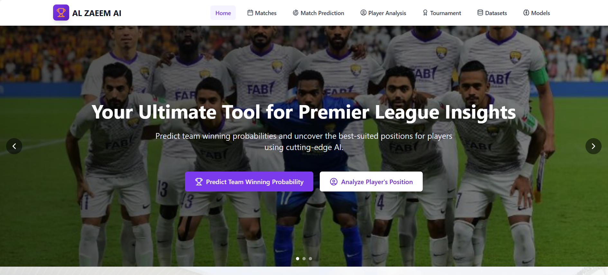
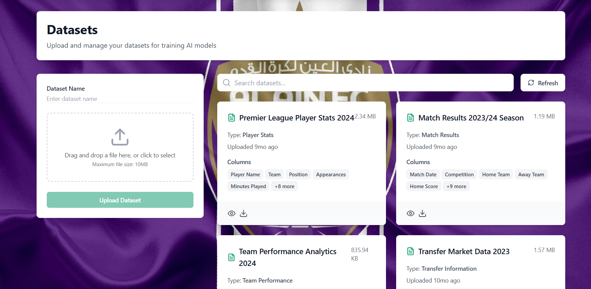
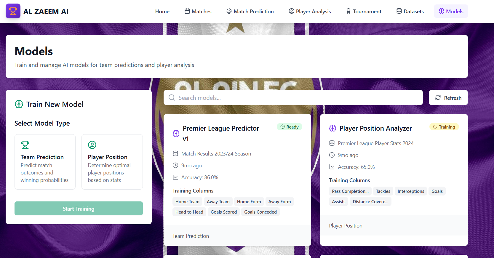
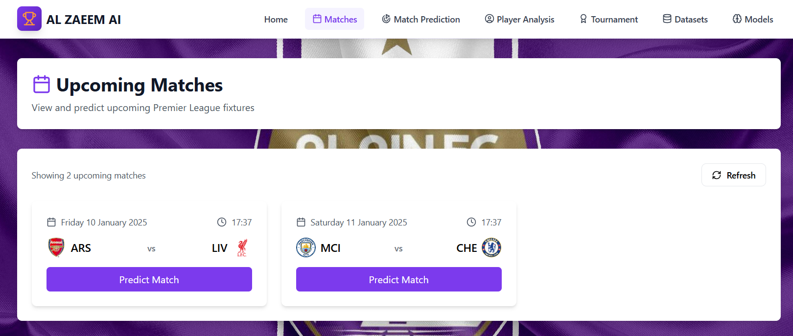
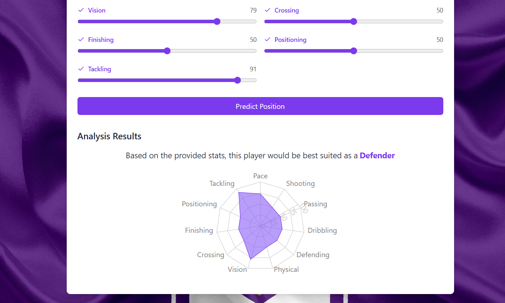
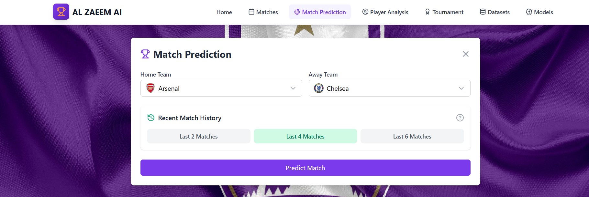
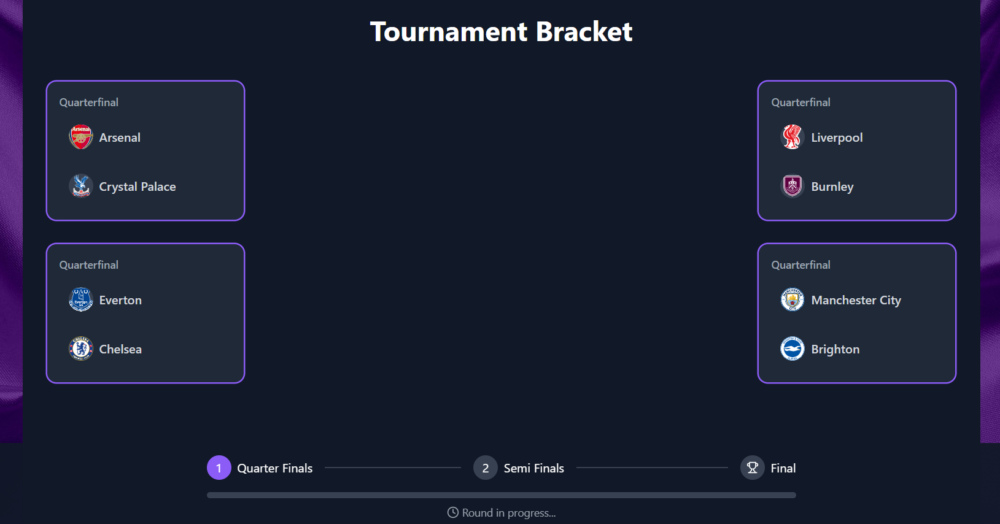

# Project Preview: AI-Powered Match Outcome and Player Position Prediction

## 🌐 Live Version
Access the live version of the application here: [Live App](https://ai-football-client.pages.dev/)

### Note:
Please note that some functionalities might not be available until the server is deployed at full scale to the internet 24/7. Thank you for your understanding as we continue to improve the platform!

---

## 📸 Screenshots

### 1. Home Page
The entry point for users, showcasing a clean and intuitive design.

---

### 2. Datasets Page
Explore, upload, and manage datasets for predictions.

---

### 3. Models Page
Interact with AI models, view configurations, and manage versions.

---

### 4. Upcoming Matches Page
View upcoming matches with AI predictions for outcomes.

---

### 5. Player Position Prediction
Analyze player data and predict optimal positions based on performance metrics.

---

### 6. Match Prediction
Input match data to predict outcomes such as home win, draw, or away win.

---

### 7. Tournament Tab
Manage and analyze tournaments with AI-powered insights.

